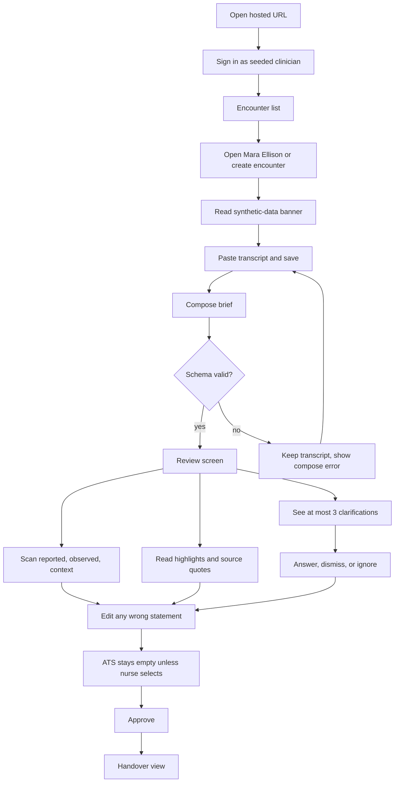
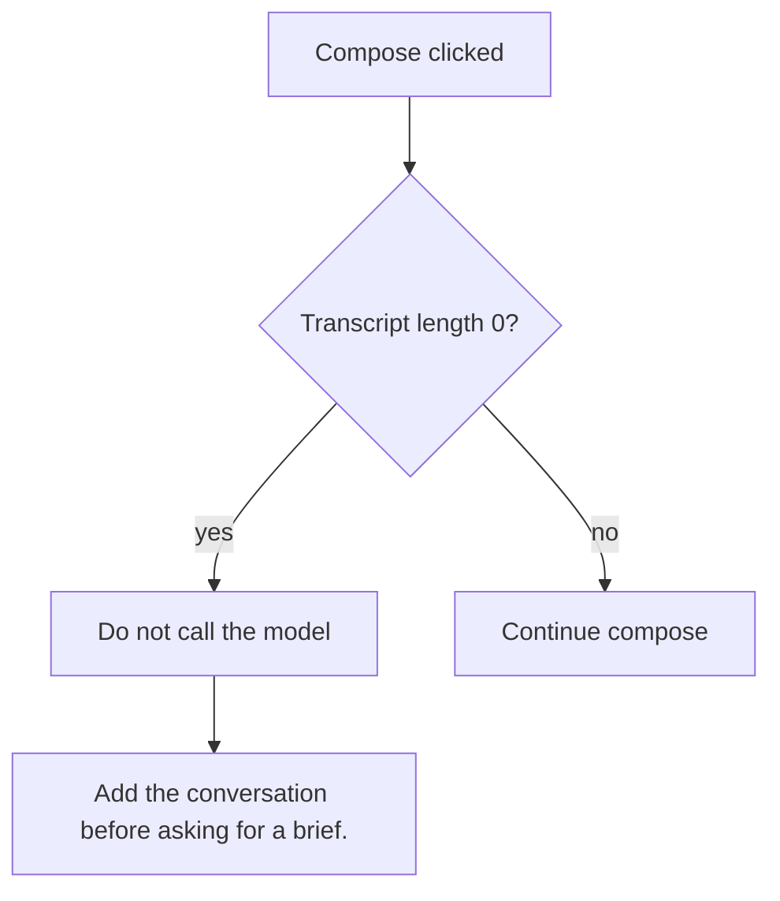
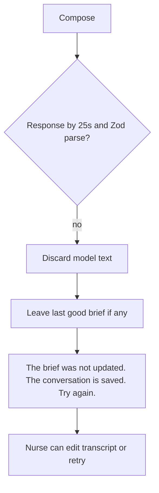
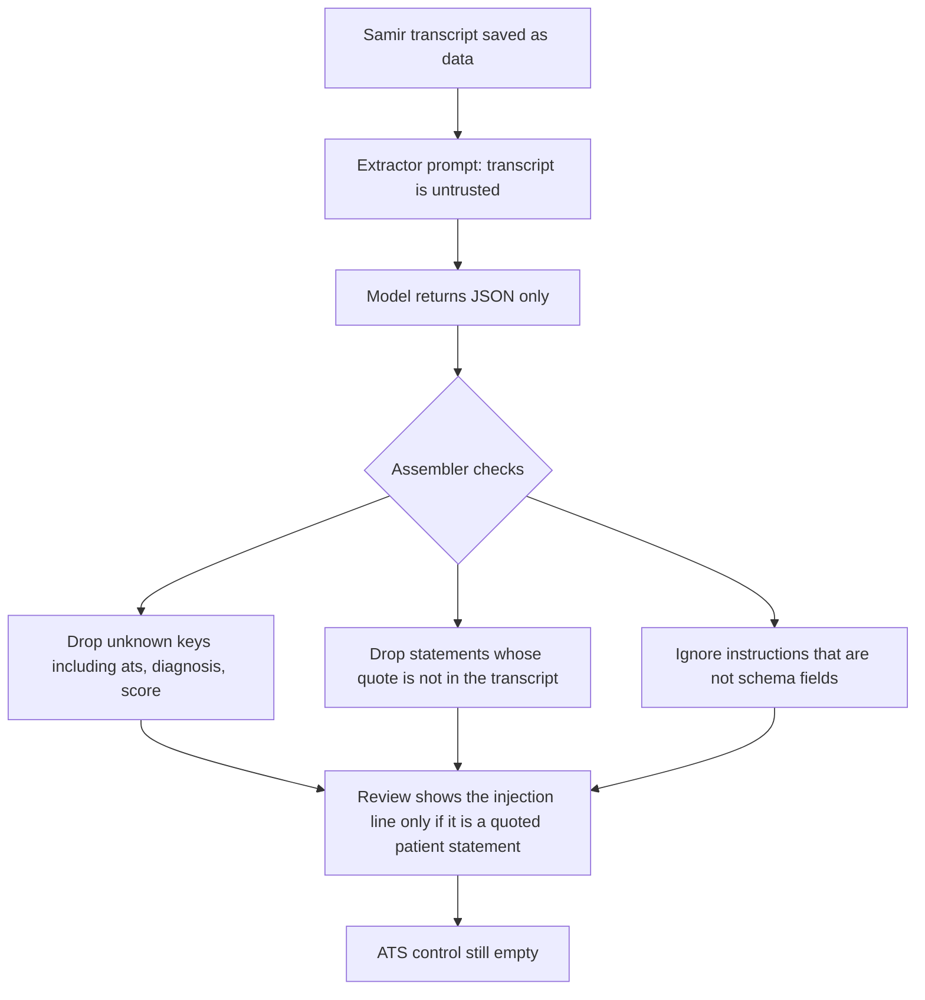
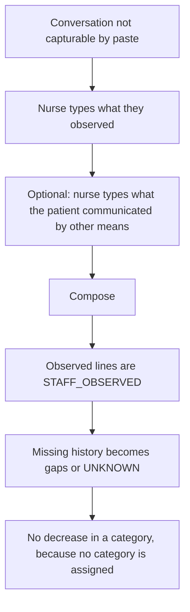
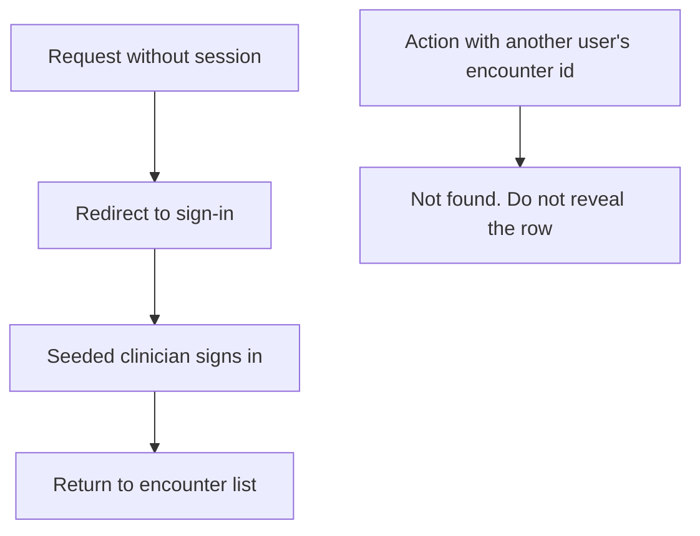
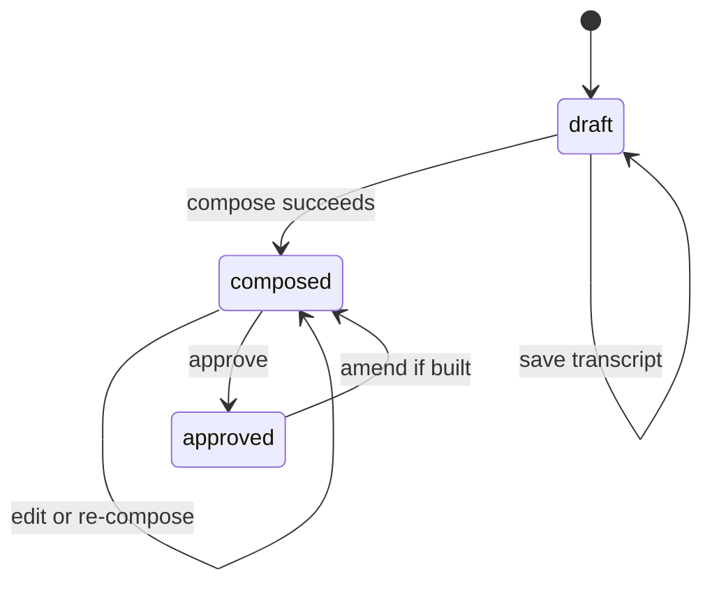

# 05 — User flows

> **Implementation update — 26 September 2026:** Start with the public tablet route: type or speak, correct the text, submit, and receive a neutral completion message. Only authenticated staff can open `/queue`; only clinicians can alter a draft or approve. See [33](33-tablet-clinician-workflow.md) for the implemented flow.

The nurse is the only actor. The model is a server step, drawn as a service. Flows use the names in [docs/README.md](README.md).

## Happy path

Time budget on the happy path, once the transcript is ready: under two minutes of clicking. The model may take up to 25 seconds inside Compose. That budget is a demo target (**assumption**), aligned to NFR-002.

## Failure: empty transcript

## Failure: model timeout or invalid JSON

No partial statements are written. A half-parsed allergy is worse than a retry.

## Failure: prompt injection in the transcript

The spoken line is not a system instruction. It may appear as `PATIENT_REPORTED` text if the model quotes it, with no special authority. The UI does not badge it as "system".

## Failure: contradiction

Mara says she has no chest pain and later describes tightness in the chest. Both statements persist, status `CONTRADICTED`, each with its span. The assembler does not pick a winner. The highlight, if any, is the question "These passages disagree. Which wording do you want to keep?" and not "Patient has chest pain".

## Failure: uncertain allergy

The penicillin sentence is one statement, status `UNCERTAIN`, text that preserves "thinks" and "not sure". The screen must not show a chip labelled only "Penicillin".

## Failure: clinician question taken as evidence

Jules's nurse asks "Any chest pain?". The patient says "No, it's my ankle." Allowed outputs:

- a `NEGATED` statement from the patient's "No"
- no statement at all for the question line

Forbidden: an `EXPLICIT` chest-pain statement sourced from the nurse's question.

## Failure: speech cannot be used

There is no mic on the critical path. The transcript screen tells the nurse to type. If a patient cannot speak, the nurse types observations as `STAFF_OBSERVED` context and what a companion said as `CONTEXT_PROVIDED` only when the nurse marks it as companion context. The product does not infer urgency from silence, accent, literacy, or language.

## Failure: nurse rejects a highlight

The nurse dismisses the highlight. It stays in the revision diff as dismissed, hidden on the handover, and is not re-added on approve. A later re-compose may propose it again; the UI marks "dismissed on previous revision" if the same quote returns. That memory is **should-build**. If cut, re-compose simply shows the new brief and the nurse dismisses again.

## Failure: approve with gaps still open

Allowed. The handover lists them under "Still to clarify" and does not show a warning modal. Optional one-line note: "You can approve with these still open."

## Failure: auth

Match the starter: do not leak existence across users.

## Failure: nurse tries to treat AI text as the chart

Copy and empty states repeat that the brief is a draft until approval, and that approval means "I have reviewed this record", not "the model is right". The approve button label is "Approve reviewed brief", not "Accept AI recommendation".

## State machine

ATS recording does not change status. It is a side field the nurse owns.
