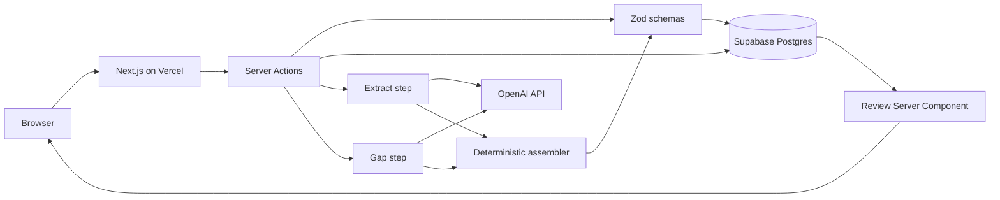

# 07 — System architecture (MVP)

> **Implementation update — 26 September 2026:** Anonymous tablet capture uses one constrained Supabase security-definer RPC that atomically stores a write-once encounter and draft. Server Actions validate the form and call a server-only composition boundary; the desktop remains Server Component reads plus clinician-only actions. See [33](33-tablet-clinician-workflow.md).

## Recommendation

One Next.js 16 App Router application on Vercel, Supabase Postgres for data and auth, the model called only from server code. No extra service, no queue, no microservice. This matches the starter, the SaaSathon suggested stack (Vercel, Supabase, and Railway only if something will not fit serverless), and a 21-hour clock.

Railway is unnecessary while compose finishes inside a serverless limit. If a compose call regularly dies on Vercel's duration cap, the cut is a shorter transcript and a faster model, not a new worker. A worker is post-hackathon.



## Why this fits the hackathon

- The repo is already Next.js, TypeScript strict, Tailwind v4, Zod, Supabase SSR, pnpm.
- Reads stay in Server Components. Mutations stay in Server Actions. Client islands only for the transcript box, gap buttons, ATS select, and approve confirm.
- Auth ownership comes from `auth.uid()`, the pattern in `supabase/migrations/20260908000000_ideas.sql`.
- One deploy target. SaaSathon tells teams to deploy early because demos die on hosting, not on ideas.
- The AI feature is real (extract and gaps) without a chat box.

## Process on compose

1. Action `composeBrief(encounterId)` loads the transcript for the signed-in user. If empty, return a typed error and do not call the model.
2. **Extract.** One chat completion, JSON schema response, temperature low. System prompt in [12-ai-design.md](12-ai-design.md). The transcript is a user-role data block delimited so it cannot become the system prompt.
3. **Gaps.** Second completion. Input is the transcript plus the extracted statements, not the raw model chatter. Ask only for clarification questions.
4. **Assemble.** TypeScript in `lib/encounters/assemble.ts`. Unions spans, drops illegal keys, caps gaps at three, sorts highlights by span start, sets `clinicianAts` to null, sets `synthetic` true, stamps disclaimer. No model call.
5. Validate with `TriageEvidenceBriefSchema`. On failure, write an `audit_events` row of type `compose_rejected` with a reason code, not the body, and return the error copy from the UX spec.
6. Insert `brief_revisions` and update `briefs` head in one transaction.

Edit, ATS, and approve do not call the model.

## Recommended folders

Add these. Do not reorganise the starter around them.

```text
app/encounters/page.tsx                 list
app/encounters/new/page.tsx             create
app/encounters/[id]/page.tsx            review
app/encounters/[id]/transcript/page.tsx paste
app/encounters/[id]/handover/page.tsx   approved view
app/encounters/actions.ts               server actions
lib/encounters/types.ts                 interfaces
lib/encounters/schema.ts                zod and JSON schema export
lib/encounters/assemble.ts              deterministic
lib/encounters/extract.ts               model boundary
lib/encounters/gaps.ts                  model boundary
lib/encounters/prompts.ts               prompt strings
lib/encounters/repository.ts            supabase queries
lib/encounters/fixtures.ts              Mara, Jules, Samir
supabase/migrations/*_front_brief.sql   new tables only
tests/brief-schema.test.ts
tests/assemble.test.ts
tests/fixtures.test.ts
```

`app/ideas` stays until the team switches the post-login redirect. Do not delete it during the doc pass, and do not need to delete it for the demo if the nav points at `/encounters`.

## Key interfaces

```typescript
export type EpistemicStatus =
  | "EXPLICIT"
  | "UNCERTAIN"
  | "NEGATED"
  | "CONTRADICTED"
  | "UNKNOWN";

export type SourceKind =
  | "PATIENT_REPORTED"
  | "STAFF_OBSERVED"
  | "CONTEXT_PROVIDED"
  | "AI_HIGHLIGHTED";

export type EncounterStatus = "draft" | "composed" | "approved";

export interface ComposeResult {
  ok: true;
  briefId: string;
  revision: number;
} | {
  ok: false;
  code:
    | "UNAUTHENTICATED"
    | "NOT_FOUND"
    | "EMPTY_TRANSCRIPT"
    | "TOO_LONG"
    | "MODEL_TIMEOUT"
    | "MODEL_INVALID"
    | "SCHEMA_INVALID";
};
```

Full brief types live in [10-triage-brief-schema.md](10-triage-brief-schema.md). Actions live in [11-api-contract.md](11-api-contract.md).

## Error handling

| Code | User copy | Logged |
| --- | --- | --- |
| `EMPTY_TRANSCRIPT` | Add the conversation before asking for a brief. | code, encounter id |
| `TOO_LONG` | This transcript is too long for the demo. Paste the triage conversation only. | code, length |
| `MODEL_TIMEOUT` | The brief was not updated. The conversation is saved. Try again. | code, latency ms |
| `MODEL_INVALID` | same | code, finish reason |
| `SCHEMA_INVALID` | same | code, zod issue paths only |
| `NOT_FOUND` | That encounter is not available. | code |
| `UNAUTHENTICATED` | redirect to `/login` | none |

Never log the transcript, the prompt, or the brief body in the default logger. See [19-observability.md](19-observability.md).

## Seed

A server-only script `scripts/seed-demo.ts`, run by a teammate against the demo project:

- Creates or finds the auth user from `DEMO_CLINICIAN_EMAIL` and `DEMO_CLINICIAN_PASSWORD` in the environment.
- Inserts three encounters and transcripts if missing.
- Does not insert a composed brief. The demo composes live, which is the point. A committed expected JSON fixture is for tests, not a substitute for the live call.
- Refuses to run if `NEXT_PUBLIC_SUPABASE_URL` contains a host the team has marked as production healthcare. For the weekend the only database is the hackathon Supabase project.

Do not commit the password. Do not put it in this repo.

## Auth choice

Supabase email/password for the single seed user is the reliable demo. Magic link depends on inbox access on stage. Document the password in the team's password manager or host secret, and in a local `.env.local` that stays gitignored.

The starter's ideas policies remain. New tables get their own policies in the new migration.

## What we are not building

- A Python agent on Railway.
- Websockets for streaming tokens.
- A separate "AI gateway".
- Client-side calls to the model with a public key. The browser never sees the API key.

## Alternatives

| Alternative | Why not this weekend |
| --- | --- |
| Railway worker for compose | Extra deploy, extra secret, no queue depth of one user |
| Edge runtime | Model SDK and timeout behaviour are simpler on the Node server runtime |
| tRPC or a public REST surface | Server Actions match the starter. HTTP shapes are specified so a route can be added, not so two stacks exist |
| Microservices per AI step | Three network hops to fail in front of a judge |
