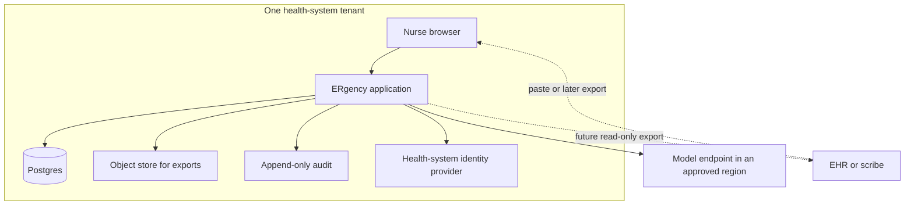

# 08 — System architecture (production)

This chapter is a target, not a build. The MVP in [07-system-architecture-mvp.md](07-system-architecture-mvp.md) stays one app. Production is still one deployable application until a measured limit forces a split. Do not draw twelve services because a health system sounds large.

Nothing here authorises real patient data. The pilot gates are in [24-pilot-plan.md](24-pilot-plan.md).

## What changes after the hackathon

| Concern | MVP | Production direction |
| --- | --- | --- |
| Identity | One seed user | SSO via the health system's IdP. RBAC: nurse, charge nurse, auditor. No patient login |
| Tenancy | One Supabase project | One tenant per health system, row-scoped by `tenant_id`, separate projects if the contract requires isolation |
| Model | Event OpenAI credits, region whatever the key uses | Contracted endpoint, region chosen for the privacy review, no training on customer text, key in a secret manager |
| Transcript | Postgres text | Same, with retention job and encryption at rest the platform already provides, plus application-level retention limits |
| Schema | JSON document | Keep the document as the clinical artefact. Normalise statements only when reporting needs it |
| Interop | None | Export mappings in [17-interoperability.md](17-interoperability.md), still after governance |
| Audio | Absent | Optional capture with the typed path always available |
| Observability | Counts and latency | Same redaction rules, plus a private trace store if a safety review requires reconstruction |
| Change control | Git push deploys | Tagged release, migration review, rollback |

## Trade-offs

**Modular monolith versus services.** A compose pipeline, a review UI, and an audit log share one transaction boundary. Splitting the model call into another service adds a second auth system and a partial-failure mode (brief saved in one place, audit in another). Split only the model call if the application host cannot keep credentials or timeouts sane. Even then, the assembler stays in the app so a model service cannot write the database.

**Document versus normalised facts.** Auditors want rows. Nurses want one brief. Store the validated JSON as the versioned artefact and project a read model later. Premature normalisation makes every prompt change a migration.

**Sync compose versus queue.** Nurses wait in the room. A queue that returns "job id" is the wrong interaction under a two-to-five-minute triage window. Keep synchronous compose with a hard timeout. Queue only overnight eval and export.

**Region.** Overseas processing of health information is a privacy question, classified in [16-privacy-governance-regulatory.md](16-privacy-governance-regulatory.md) as requiring specialist confirmation. The architecture must be able to point the model at a nominated region. The weekend build does not promise a region.

**EHR integration.** Production value might be "paste from Heidi, approve, copy handover". A deep HL7 or FHIR write is a project with the local EHR team, not a default microservice. Side-by-side beats a bot that writes the chart unattended.

## Availability

An ED tool that is down must fail into normal practice: the nurse documents in the EHR as they do today. ERgency is not on the resuscitation path. SLO hypothesis for a later pilot: the review page loads if the model is down; only compose fails. That is **unvalidated** and not a contractual SLO.

## Security boundary

The model is outside the trust boundary. It sees the transcript because that is the task, under a data-processing decision a production deployment has not made. It does not see other patients, the ATS table, or credentials. Database roles used by the app cannot update `audit_events`.

## Alternatives rejected as the default picture

- Event bus between "ingest", "NLP", "rules", and "notify". No second consumer exists.
- A bedside device like ERTRIAGE. Hardware is a different company.
- Running an open model on a GPU in the hospital this year. Revisit only if a privacy review forbids the contracted API and a health system will host it. Not assumed.

## Migration from MVP

The MVP schema's `synthetic boolean not null check (synthetic)` is the hinge. A production migration must not drop that check on the demo project. A new environment, new threat model, and a signed governance record come first. See ADR-008.
