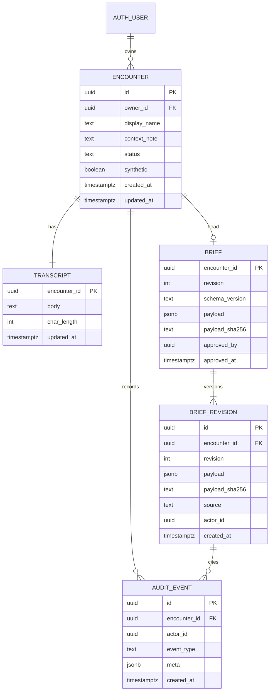

# 09 — Data model

## Recommendation

Logical model is an encounter with one current transcript, a versioned brief document, and an append-only audit. The brief document is the schema in [10-triage-brief-schema.md](10-triage-brief-schema.md). Statements, gaps, and highlights live inside that JSON for the MVP so the team migrates one artefact.

A fully normalised statement table is the post-hackathon projection when someone needs to query "all NEGATED statements". Building it now adds joins without a demo payoff.

The existing `public.ideas` table is untouched.



## PostgreSQL outline

Migration file name: `supabase/migrations/20260926120000_front_brief.sql`. New migration only. Do not edit `20260908000000_ideas.sql`.

```sql
create table public.encounters (
  id uuid primary key default gen_random_uuid(),
  owner_id uuid not null references auth.users(id) on delete cascade,
  display_name text not null check (char_length(btrim(display_name)) between 1 and 80),
  context_note text not null default '' check (char_length(context_note) <= 1000),
  status text not null default 'draft' check (status in ('draft', 'composed', 'approved')),
  synthetic boolean not null default true check (synthetic = true),
  created_at timestamptz not null default now(),
  updated_at timestamptz not null default now()
);

create index encounters_owner_updated_idx
  on public.encounters (owner_id, updated_at desc);

create table public.transcripts (
  encounter_id uuid primary key references public.encounters(id) on delete cascade,
  body text not null check (char_length(body) <= 20000),
  updated_at timestamptz not null default now()
);

create table public.briefs (
  encounter_id uuid primary key references public.encounters(id) on delete cascade,
  revision integer not null check (revision >= 1),
  schema_version text not null check (schema_version = '1.0.0-mvp'),
  payload jsonb not null,
  payload_sha256 text not null check (payload_sha256 ~ '^[0-9a-f]{64}$'),
  approved_by uuid references auth.users(id),
  approved_at timestamptz,
  check (
    (approved_at is null and approved_by is null)
    or (approved_at is not null and approved_by is not null)
  )
);

create table public.brief_revisions (
  id uuid primary key default gen_random_uuid(),
  encounter_id uuid not null references public.encounters(id) on delete cascade,
  revision integer not null check (revision >= 1),
  payload jsonb not null,
  payload_sha256 text not null,
  source text not null check (source in ('compose', 'edit', 'approve', 'amend')),
  actor_id uuid not null references auth.users(id),
  created_at timestamptz not null default now(),
  unique (encounter_id, revision)
);

create index brief_revisions_encounter_idx
  on public.brief_revisions (encounter_id, revision desc);

create table public.audit_events (
  id uuid primary key default gen_random_uuid(),
  encounter_id uuid not null references public.encounters(id) on delete cascade,
  actor_id uuid references auth.users(id),
  event_type text not null check (event_type in (
    'encounter_created',
    'transcript_saved',
    'compose_succeeded',
    'compose_rejected',
    'statement_edited',
    'observation_added',
    'gap_dismissed',
    'highlight_dismissed',
    'ats_recorded',
    'approved',
    'amend_started'
  )),
  meta jsonb not null default '{}'::jsonb,
  created_at timestamptz not null default now()
);

create index audit_events_encounter_idx
  on public.audit_events (encounter_id, created_at);
```

`payload` must already have passed Zod in the server action before insert. A later check constraint can reject payloads containing keys `confidence`, `riskScore`, `diagnosis`, or `recommendedAts`. Do that in SQL only if it is a one-liner the team can test; Zod is the gate that must exist regardless.

```sql
alter table public.briefs
  add constraint briefs_payload_no_score check (
    not (payload ?| array['confidence', 'riskScore', 'diagnosis', 'recommendedAts'])
  );
```

Apply the same check to `brief_revisions.payload`.

## Grants and RLS

Follow the ideas migration style.

- Enable RLS on all four new tables.
- `revoke all` from `anon` and `authenticated`, then grant the minimum.
- `authenticated` may select encounters, transcripts, briefs, revisions, and audit rows where the parent encounter's `owner_id = auth.uid()`.
- Inserts and updates go through security definer functions **or** policies that repeat the owner check. Prefer policies plus server actions using the user-scoped Supabase client, matching the starter. Do not use the service role in the request path.
- `audit_events`: grant `insert` and `select` to `authenticated`. No `update`, no `delete`.
- `brief_revisions`: grant `insert` and `select`. No `update`, no `delete`.
- `transcripts`: grant `select`, `insert`, `update` of `body` and `updated_at`.
- `briefs`: grant `select`, `insert`, `update`. Deletes cascade from the encounter only if the owner deletes the encounter. Encounter delete is **cut**; do not expose it in the UI. Grant delete on encounters only if a ticket needs it. Recommendation: no delete in the MVP UI, so no delete policy.

Two-account test, required by `AGENTS.md` for every new public table: sign in as user A and user B, create an encounter as A, assert B's select returns zero rows and B's update affects zero rows. Put it in `scripts/test-integration.ts` style, local database only.

## Versioning

- `brief_revisions.revision` increments by 1.
- `briefs` is the head pointer.
- `source = 'compose'` replaces statements from the model but the assembler must copy forward `clinicianAts` if the nurse already recorded one, so a re-compose does not wipe the nurse's category. The model still cannot set it. If the previous category was null, it stays null.
- `source = 'edit'` writes a new revision from the edited document.
- `source = 'approve'` writes a revision whose payload matches the head and sets `approved_by` and `approved_at`. Status on the encounter becomes `approved`.
- Hash is SHA-256 of the canonical JSON (stable key order) so the handover can show a short fingerprint. The hash is integrity for the demo, not a legal seal.

## Audit meta allow-list

`meta` may contain: `revision`, `reason_code`, `schema_version`, `gap_id`, `statement_id`, `ats_set` (boolean, not the category if you want extra caution; **recommendation:** store the category in the brief payload only, and put `ats_set: true` in meta). Do not put transcript text in `meta`.

## Indexing notes

The owner/updated index serves the list. The revision unique key prevents two writers clobbering the same number; the action should retry once on conflict. No GIN index on payload for the MVP. Do not index clinical text.

## Seed rows

The seed script inserts `encounters` and `transcripts` only. Identifiers can be fixed UUIDs in the seed so tests can refer to them, generated once and checked in as constants, not as patient data. Display names: Mara Ellison, Jules Pene, Samir Holt. `synthetic` true. `status` draft.

## Post-hackathon tables, not migrated now

`tenants`, `memberships`, `statement_projections`, `export_jobs`. Mentioned so nobody creates them on Saturday.
